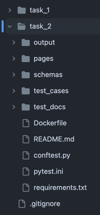
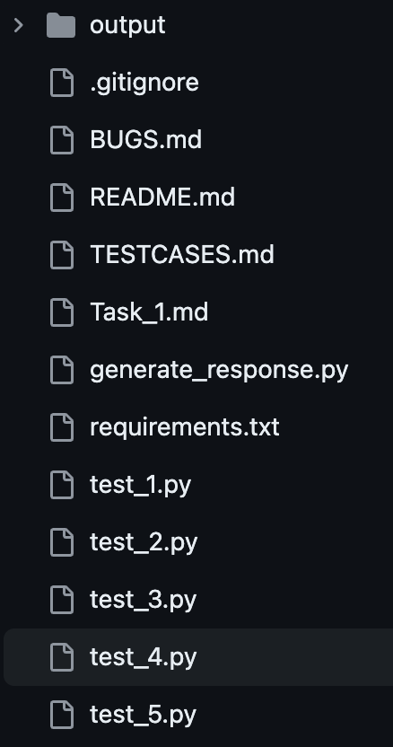
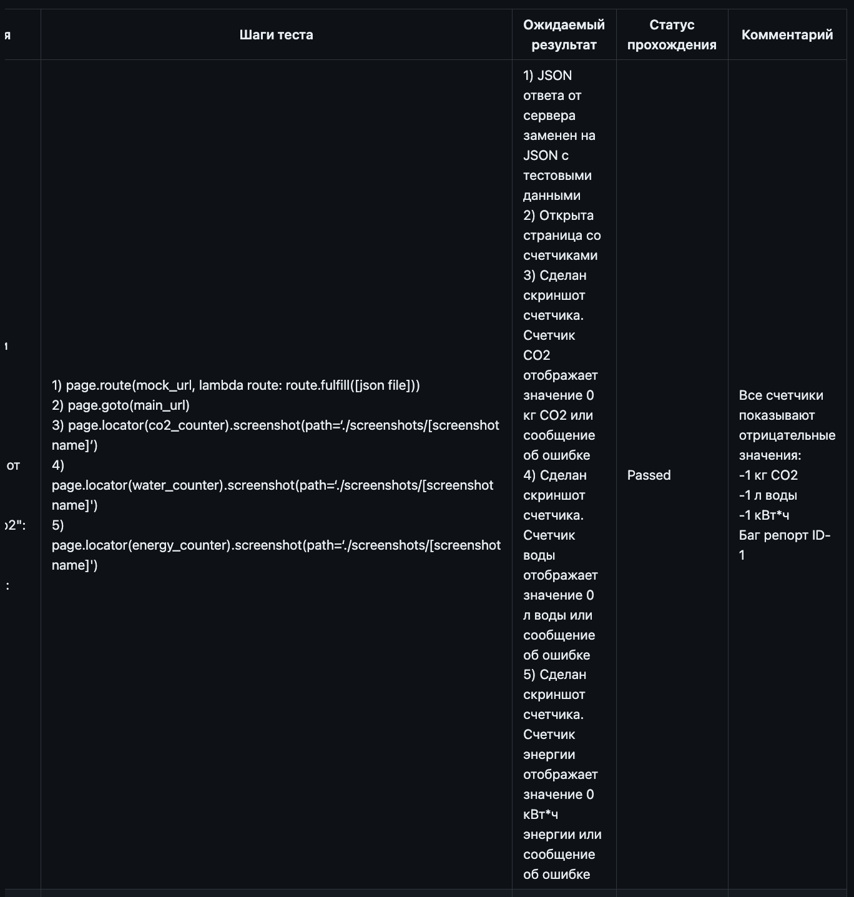
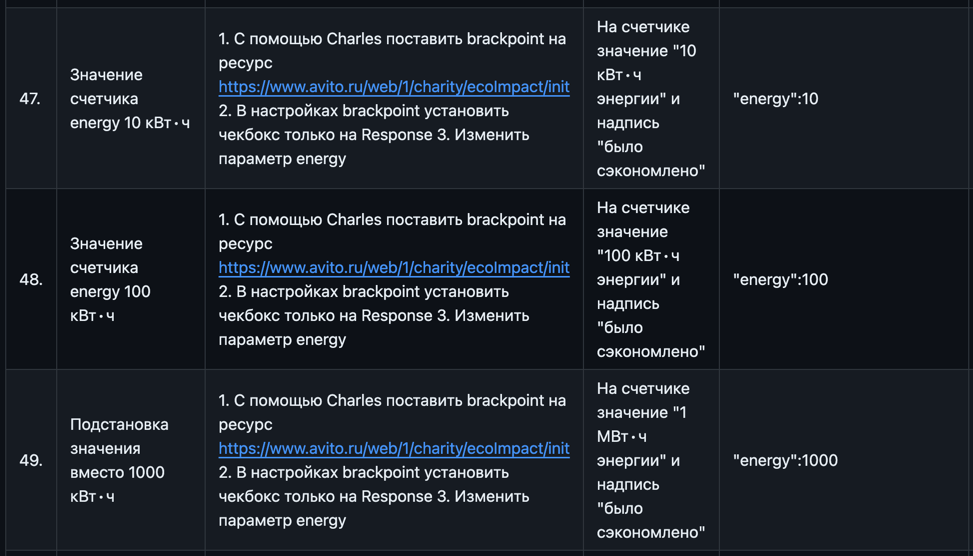
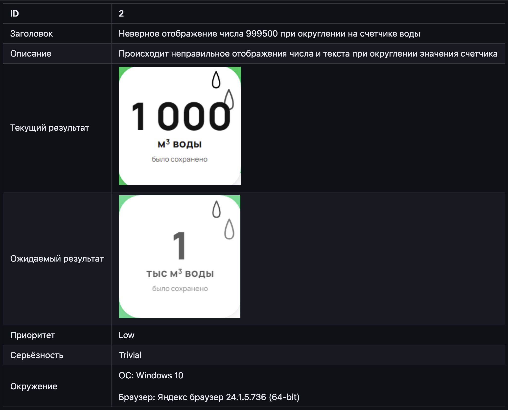
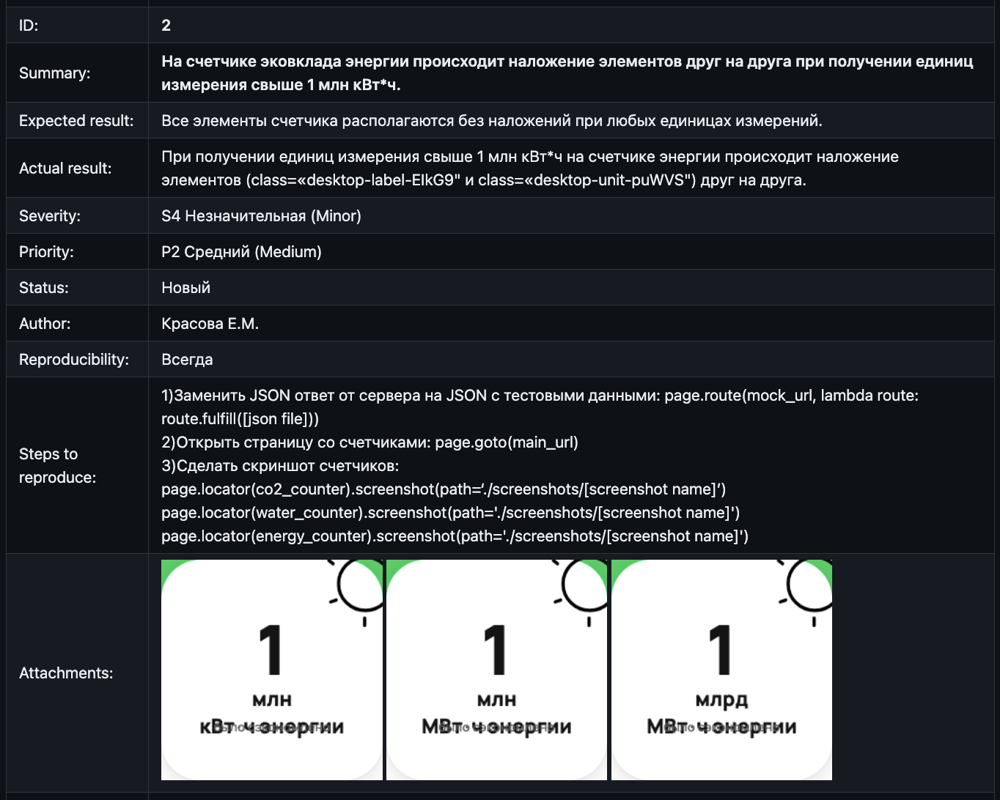
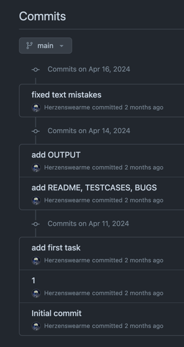
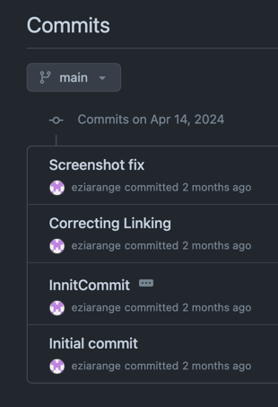
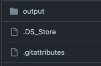

# Обзор вариантов выполнения задания на написание автотеста
В этом году при составлении тестового задания мне хотелось выйти из коробочки blackbox UI e2e тестирования и дать стажёрам пощупать что-то настоящее, чтобы они исследовали и увидели немного изнанки современных подходов к построению сервисов.
На одной странице несколько микрофронтов. Фронтенд — это только отображение данных с бекенда. Знает ли бекенд, что может, а что не может отобразить фронт? Готов ли фронтенд отобразить всё, что пришлёт ему бекенд?

## Задание
### Backend-Driven UI и микрофронтенды

В Avito применяются два подхода для конструирования фронтенда: Backend-driven UI и микрофронтенды.

> Backend-driven UI — это подход к проектированию интерфейсов, при котором в приложении есть набор компонентов, с которыми приложение умеет работать, а расположение, порядок и наполнение этих блоков приходят с бэкенда.
> 
> Backend-driven UI решает проблему хардкода большого количества полей в формах на клиенте, а также связей между этими полями. Если вся логика вынесена на бэкенд, то клиент становится более гибким и расширяемым с бэкенда.
>
>*https://habr.com/ru/companies/avito/articles/501698/*

Рассмотрим применение этих подходов на примере страницы «Эковклад»: https://www.avito.ru/avito-care/eco-impact

На этой странице есть три счётчика для подсчёта эковклада: CO2, воды и электроэнергии.
(см. картинку ниже)

Числа, отображаемые в этих счётчиках приходят с бэкенда. Обработкой этих чисел занимается микрофронтенд: в его задачи, например, входит отображать в счётчике только трёхзначное число, подставляя правильную приставку: вместо 1000 литров — 1 метр кубический.

Твоей задачей будет подобрать тестовые данные и протестировать поведение счётчиков.

Результатом задания должны быть: 
1. Список тест-кейсов
2. Скриншоты фактических состояний счётчика
3. Инструкция для получения скриншотов
4. Опционально: список багов

Подсказка №1: Старайся использовать техники тест-дизайна и минимизировать количество тест-кейсов.

Подсказка №2: Выполнить это задание можно используя разные подходы, и мы никак не ограничиваем тебя в применяемых инструментах, но намекнём, что для выполнения задания хватит и браузера =)

## Методы оценки
Довольно легко сказать «это плохой код». Нарушение договорённостей языка, неясность логики, сумбурная структура — яркие маркеры.
Но вот сказать «этот код лучше» — сложнее. Тут начинается субъективщина.

Ещё сложнее понять, что перед тобой хороший автотест. Вопрос про «критерии хорошего автотеста» часто встречается на собеседованиях, и на него можно ответить с разной степенью детальности.
«Атомарный, читаемый, стабильный...» — набор характеристик можно продолжать, я встречал списки, в которых было по 25 пунктов.
Но кончается ли дело автотестом? Для чего он вообще написан? Так ли важен его код?

Я предлагаю вам посмотреть на кусочки вариантов выполненного задания от тех ребят, кто прошёл строгий отбор и получил оффер на стажировку. Они в сжатые сроки справились лучше остальных — это уже достойно похвалы.
Рассматривая эти фрагменты, попробуйте встать в позицию проверяющего — что для вас было бы важно при проверке?
Вообще для QA очень важно умение смотреть на мир «от лица» кого-то: нового пользователя, сотрудника поддержки, коллеги QA.

От себя я вставлю пару оценочных (по возможности нетоксичных суждений), чтобы было понятно к чему нужно стремиться.

### Структура проекта
Структура проекта, логика директорий и наименований файлов — это всё часть культуры работы с кодом.
Если взять самые красивые, понятные и стабильные автотесты и сложить их в папочку «new folder» с именами `test_1`, `test_2` — они сразу станут непонятными и некрасивыми.
#### Иерархичная стурктура, понятные названия:


#### Плоская структура с безликими именами:

### Инструкция 
Инструкция: чем проще, тем лучше: склонировать, установить зависимости, запустить.

### Инструкция по запуску тестов

#### В меру подробная инструкция
1. Склонируйте к себе репозиторий, в котором хранится проект тестового задания, через выполнение команды в терминале
    ```
    git clone https://github.com/Herzenswearme/AvitoTech_QA-trainee.git
    ```
    Или скачайте zip архив по [ссылке](https://github.com/Herzenswearme/AvitoTech_QA-trainee/archive/refs/heads/main.zip) и распакуйте его


2. Убедитесь, что на Вашем компьютере установлен Python. В командной строке/терминале выполните команду
    ```
    python -v
    ```  

    Если он не установлен, то установите с официального [сайта Python](https://www.python.org/downloads/), выбрав подходящую версию для Вашей операционной системы, и пройдите шаг сначала.  
    >В процессе установки обязательно поставьте галочку в чекбоксе "Add python.exe to PATH". Иначе, у Вас не будет корректно отображаться версия Python


3. Через командную строку/терминал перейдите в корневую директорию проекта, выполнив команду
   ```
   cd /здесь укажите путь до директории с проектом
   ```


4. Установите необходимые зависимости из файла `requirements.txt`, выполнив команду  
   ```
   pip install -r requirements.txt
   ```
   если она не выполняется, то попробуйте
   ```
   pip3 install -r requirements.txt
   ```


5. После успешной установки зависимостей, установите необходимые бинарные файлы браузеров, выполнив команду
   ```
   playwright install
   ```
   

6. Наконец, запустите тесты, выполнив команду  
   ```
   pytest -v
   ```
   
> Очень приятная инструкция, написанная живым человеческим языком. От такой инструкции веет теплотой. Чувствуется, что с софт-скиллами у человека всё окей.
   
#### До жестокости подробная (и усложнённая) инструкция
1. Открыть PyCharm.
2. В верхнем меню навести курсором на “File”.
3. В выпадающем списке нажать на “New Project..”.
4. Поставить чек-бокс на “Create a main.py welcome script”.
5. Нажать кнопку “Create”.
6. Нажать кнопку “This Window”.
7. Вернуться в GitHub и скопировать код из файла “test.py”.
8. Вернуться в PyCharm и вставить скопированный код в созданный файл main.py.
9. Открыть терминал(В нижнем левом углу нажать на значок  квадрата внутри символы >_) . Откроется терминал.
10. Написать в терминале команду pip install pytest-playwright. Подождать, когда закончится загрузка.
11. Написать в терминале команду playwright install. Подождать, когда закончится загрузка.
12. Для получения скриншотов для счетчика воды нажать на зеленый треугольник находящийся рядом с функцией def test\_water(page: Page): . Нажать на Run.
13. Подождать, когда функция завершит работу.
14. Если возникли ошибки при запуске, то зайти в терминал и вставить команду pytest -k test\_water
15. Для получения скриншотов для счетчика CO2 нажать на зеленый треугольник находящийся рядом с функцией def test\_co2(page: Page): . Нажать на Run.
16. Подождать, когда функция завершит работу.
17. Если возникли ошибки при запуске, то зайти в терминал и вставить команду pytest -k test\_co2
18. Для получения скриншотов для счетчика энергии нажать на зеленый треугольник находящийся рядом с функцией def test\_energy(page: Page): . Нажать на Run.
19. Подождать, когда функция завершит работу.
20. Если возникли ошибки при запуске, то зайти в терминал и вставить команду pytest -k test\_ energy
21. Слева появится папка с названием “output”. В ней расположены полученные скриншоты. 

> Вместо первых 8 пунктов можно было просто написать «склонируйте репозиторий». Хотя даже это лишнее. 


### Параметризация
Сила автотестов — в повторяемости. Вы берёте входные данные, описываете в коде действия с ними и свои ожидания от результата.
Если действия одни и те же, а меняются только входные данные — это нужно параметризировать! 

---
```python
    a = [1, 999, 1000, 1001, 9954, 9955, 10000, 10001, 10049, 10050, 99950, 100000, 100499, 100500, 999449, 999500,
          1000000, 1044000, 1045000, 999449000, 999500000, 1000000000]
    for i, elem in enumerate(a):
        page.goto("https://www.avito.ru/avito-care/eco-impact", wait_until="domcontentloaded")
```
> Однобуквенная переменная, хранящая все кейсы в одном списке — трудная для восприятия структура.

---
```python
@pytest.mark.parametrize('co2, energy, materials, pine_years, water, test_case', (
        (0, 0, 0, 0, 0, 'TK-1'),
        (999, 999, 999, 999, 999, 'TK-2'),
        (1000, 1000, 1000, 1000, 1000, 'TK-3'),
        (1500, 1500, 1500, 1500, 1500, 'TK-4'),
        (1000000, 1000000, 1000000, 1000000, 1000000, 'TK-5'),
        (1000000000000, 1000000000000, 1000000000000, 1000000000000, 1000000000000, 'TK-6'),
        (1000000000000000, 1000000000000000, 1000000000000000, 1000000000000000, 1000000000000000, 'TK-7'),
        (-1, -1, -1, -1, -1, 'TK-8'),
))
```
> Использована параметризация, кейсы объединены в классы эквивалентности, у кейсов есть имя.
> Что можно улучшить: здесь очевидно можно избавиться от дублирования чисел. 
---

```python
        replaceable_responses = [
            generate_response(co2=1, energy=50, water=999),  # ОР: co2 = 1 кг, energy = 50 кВт/ч, water = 999 л
            generate_response(co2=1000, energy=1000, water=1000),  # ОР: co2 = 1 т, energy = 1 МВт/ч, water = 1 м3
            generate_response(co2=1000000, energy=1000000, water=1000000),  # ОР: co2 = 1 тыс. т, energy = 1 тыс. МВт/ч, water = 1 тыс. м3
            generate_response(co2=1000000000, energy=1000000000, water=1000000000),  # ОР: co2 = 1 млн. т, energy = 1 млн. МВт/ч, water = 1 млн. м3
            generate_response(co2=1000000000000, energy=1000000000000, water=1000000000000),  # ОР: co2 = 1 млрд. т, energy = 1 млрд. МВт/ч, water = 1 млрд. м3
            generate_response(co2=1000000000000000, energy=1000000000000000, water=1000000000000000)  # ОР: co2 = 1 квдрлн. т, energy = 1 квдрлн. МВт/ч, water = 1 квдрлн. м3
        ]
```
> Использованы комментарии для хранения ожидаемого результата. Но не очень удачно — горизонтальный скролл — это плохо.
> Однако, почему-то в первом кейсе использованы разные значения 🤔
> Ещё никто не улучшил читаемость больших чисел используя встроенные в пайтон способы, например `1_000_000` или `10**9`

---
```go
// Граница конвертации в тонны
	{
		testName:    "Energy 998",
		description: "Класс [0:1000) шаг в границу ",
		energyValue: 998,
	},
	{
		testName:    "Energy 999",
		description: "Класс [0:1000) граничное значение и шаг за границу для класса [1000:1000000)",
		energyValue: 999,
	},
	{
		testName:    "Energy 1000",
		description: "Класс [0:1000) шаг за границу и граничное значение для класса [1000:1000000)",
		energyValue: 1000,
	},
	{
		testName:    "Energy 1001",
		description: "Шаг за границу для класса [1000:1000000)",
		energyValue: 1001,
	},
	{
		testName:    "Energy 550000",
		description: "Класс [1000:1000000) типичный представитель",
		energyValue: 550000,
	},
```
> Параметризация с помощью структуры позволяет максимально полно описать что и почему тестируется.

### Тесткейсы

> Таблица с узкими колонками горизонтальным скроллом — проявление неуважения к читающему.

---

> 68 тест-кейсов, в которых 33 раза повторены слова «1. С помощью Charles...». Не для этого ли придуманы общие предусловия?  

### Багрепорт
Чёткая структура, багрепорт — как карточка, которая помещается на один экран. 




### Работа с Git

> Последовательная многодневная история коммитов — короткий рассказ о разработке тестов, с этой немногословной «1» в середине.

---

> Здесь вся работа над тестами уложилась в час времени. Весьма похвальная скорость!

---

> Неуловимый, вездесущий и такой бесполезный в репозитории .DS_Store ))
