# Введение
Разработчики Авито стремятся создавать приложения, которые удовлетворяют потребностям пользователей и соответствуют современным стандартам. В этой статье мы: 
* обратим внимание на частые ошибки, которые совершают кандидаты;   
* расскажем, как их избежать;  
* поделимся нашими лучшими практиками разработки frontend-приложений; 
## Взгляд пользователя
Чтобы понять, качественно ли вы выполнили работу, посмотрите на неё не как разработчик, а как обычный пользователь: что удобно, а что – нет; подумайте, где можете споткнуться. 

Каждый день вы используете много приложений – анализируйте их тоже: какие решения удобны, а что вы бы улучшили. Развивайте насмотренность, и со временем вы будете учитывать в своих решениях всё больше деталей. 

Ниже расскажем, о каких нюансах часто забывают кандидаты. 
## Ховеры
Обычно, когда пользователи наводят курсор на интерактивные элементы, он меняется на маленькую руку. Если этого не происходит, пользователи могут немного растеряться.

На скриншотах ниже – примеры привычного поведения курсора.  

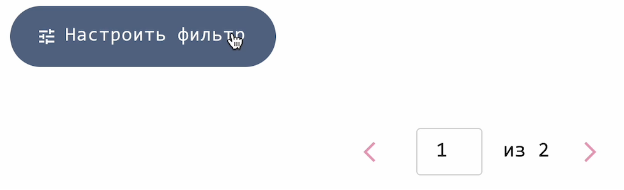
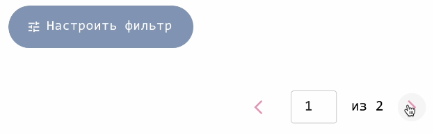

## Поиск
Разработать компонент поиска может показаться простой задачей. Но при его разработке нужно учитывать важные моменты: 
* Решить, как будет осуществляться запрос к серверу: по нажатию кнопки «Найти» или сразу при вводе текста в поисковую строку. Если выбираете второй вариант, используйте декоратор или хук debounce – они предотвратят лишнюю нагрузку на сервер.   
* Определить, с какого количества символов поиск будет начинать работать — обычно это от 3 букв.  
* Задуматься, будет ли у компонента поиска история. Если да, то как она будет реализована. Желательно сохранять историю между перезагрузками и контролировать количество сохранённых значений. Используйте для этого localStorage.   
* Помнить, что поиск не должен ограничиваться только прямым совпадением строки. Хороший поиск поддерживает частичное вхождение, что улучшает пользовательский опыт.
## Адаптивный дизайн
Дизайн сайта автоматически подстраивается под размер окна браузера, а дизайн приложения – под экран смартфона. Если этого не происходит и дизайн «не поместился» на экран, пользователю может быть не удобно. Если наоборот – осталось много пустоты, может создаться впечатление, что интерфейс неполноценный. 

На скриншотах можно увидеть, как меняется дизайн приложения в зависимости от размера экрана. Во всех случаях все важные элементы доступны пользователю. 

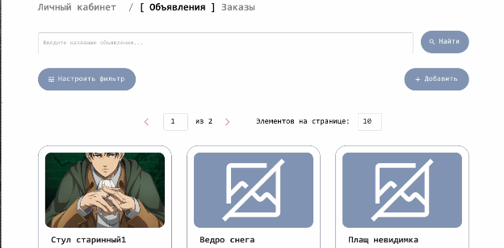
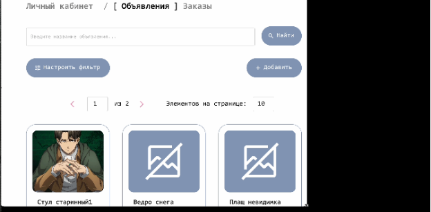

## Картинка-заглушка (fallback image)
Пользователи привыкли, что если где\-то должно быть изображение, но его нет, на этом месте появляется картинка-заглушка. Её отсутствие может нарушить восприятие интерфейса и вызвать у пользователя недоумение. 

На иллюстрации приведён пример с заглушкой и без неё. Вариант с заглушкой выглядит естественно, а вариант без неё – нет. 

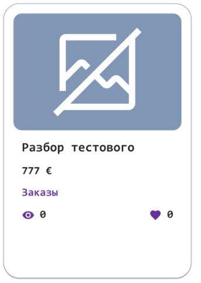
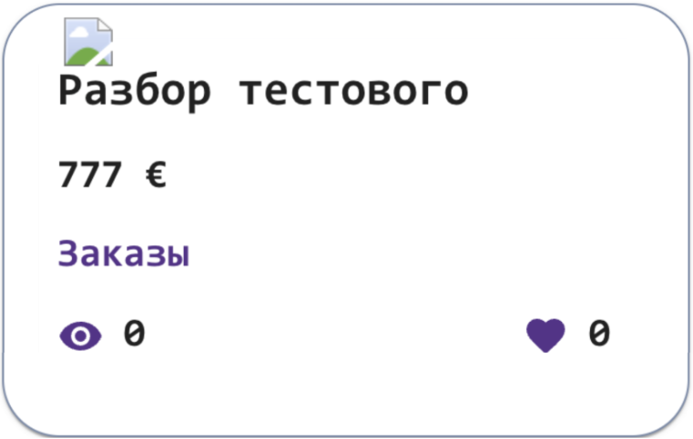
## Кнопка для скролла наверх
Когда пользователи просматривают длинные страницы, они привыкли видеть где\-то сбоку или внизу кнопку, позволяющую «прокрутить» страницу наверх и вернуться в начало. Эти действия часто дублируются кнопкой "Home" или сочетанием клавиш, но редко кто ими пользуется – кнопка прокрутки сбоку или внизу привычнее. Её отсутствие может вызвать неудобства.

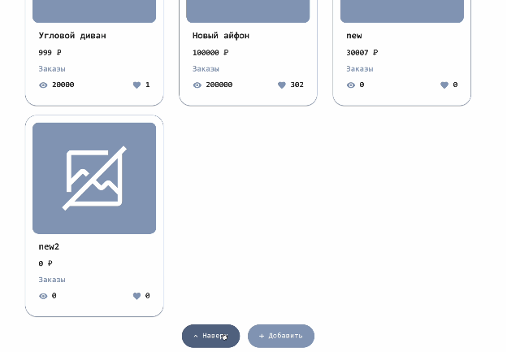

## Лоадеры
Лоадеры — это компоненты, которые информируют пользователя о том, что в приложении происходят какие-то процессы, и нужно подождать. Без лоадеров пользователь будет смотреть на пустую страницу и решит, что всё зависло. Он может не дождаться загрузки и покинуть сайт преждевременно.
## Анимации
Анимации при добавлении или сокрытии компонентов помогают пользователю легче воспринимать изменения на странице. Без них интерфейс может выглядеть резким и «топорным». Анимация делает переходы плавными и создаёт ощущение «живого» приложения.
# Общие рекомендации
Здесь мы собрали общие рекомендации к выполнению задания. Они не только подойдут для тестового, но и будут полезны в коммерческих проектах. Вы сможете быстрее и качественнее разрабатывать приложения, а проверяющий сможет быстро понять код. 
## Используйте Git
В разработке важно грамотно использовать систему контроля версий. Git помогает структурировать процесс разработки, оперативно реагировать на баги, поддерживать стабильность и чистоту кода. 

Кроме того, это хороший помощник для проверяющего. 

Разделяйте функционал на логичные части и пишите информативные сообщения для коммитов. 
## Продумайте архитектуру
Выбрать архитектуру стоит на этапе инициализации проекта. Может показаться, что это неважно, но на практике проекты быстро разрастаются, их становится неудобно развивать и поддерживать. 

Вариантов много: MVC, MVVM, FLUX, MVP, FSD, ATOM. Конкретный выбор зависит от проблем, которые вы хотите решить. 

## Разделяйте код на компоненты
Перед разработкой представьте, как незнакомый с кодом человек  будет его читать Быстро ли он поймет суть происходящего? Когда в коде есть сложные компоненты, например, те, в которых переплетена реализация разных UI-блоков, понять происходящее в коде становится сложнее.  

Максимально разделяйте логику на разные компоненты. Отделяйте презентационные компоненты от компонентов с бизнес-логикой, избегайте дублирования кода – выносите переиспользуемые функции/компоненты на слой выше. Так код станет более понятным и читаемым. Это поможет не только проверяющему, но и вам, когда вы вернётесь к коду через пару месяцев.
## Объявляйте "Global Store"
Иногда приложения используют одни и те же данные в компонентах, находящихся на разных уровнях вложенности. Постоянное пробрасывание props внутрь компонентов приведет к props hell. Это ухудшит восприятие происходящего и  может привести к непредвиденным ошибкам, которые к тому же сложно идентифицировать.

Чтобы избежать проблем, при необходимости объявляйте в проекте глобальное хранилище. 
## Тестируйте 
Unit-тесты помогают обеспечить стабильность, надежность и устойчивость кода к изменениям, а также улучшают процесс разработки и снижают риски при выпуске новых версий.
## Самостоятельно проверяйте код
Перед публикацией или отправкой работы проверьте: 
1. Как работают функциональные требования задания.
2. Есть ли в консоли ошибки или предупреждения. Если да, разберитесь в причинах уведомлений и устраните их.
3. Нет ли лишних console.log().
## Форматируйте код
Отформатированный код выглядит чище и понятнее, в нём проще искать баги и стилистические ошибки. В командной работе единый стиль форматирования помогает поддерживать код консистентным, наладить общее взаимодействие и облегчает процесс разработки. 

Форматировать код и контролировать его качество помогают инструменты: 
* линтеры, например, _ESLint_;   
* утилита _prettier_;   
* precommit hooks. 

## Используйте TypeScript
TypeScript имеет много важных преимуществ: он помогает повысить качество кода, снизить количество ошибок и облегчить процесс разработки и поддержки приложений. Поэтому современные фронтенд-разработчики часто его используют. Особенно полезен TypeScript в крупных проектах, где важны типобезопасность, читаемость и поддержка кода. 

Миграция с обычного js не будет бесшовной – вы столкнетесь с кучей предупреждений и ошибок. Но когда вы освоите TypeScript, вы оцените его удобство. 
## Readme
Первое, с чем встречается гость вашего проекта – это файл readme. Чем понятнее он описан, тем лучше и быстрее проверяющий поймет суть проекта и содержание репозитория. 

Обратите внимание на репозитории других разработчиков – насколько удобнее разбираться в них при качественно написанном readme. 
# Частые ошибки в коде
Впереди несколько задачек, основанных на частых ошибках. Попытайтесь ответить на вопросы самостоятельно, а потом сверьтесь с ответом. 

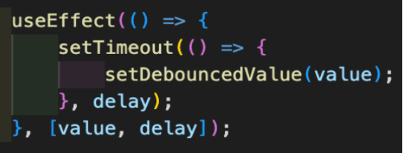
### Вопрос
Пользователь вводит значение в поисковую строку, но чтобы избежать лишней нагрузки, мы отправляем запрос к серверу не сразу. Для этого устанавливаем таймер, который срабатывает через определённое время. Что нужно добавить, чтобы эта схема работала корректно?
### Ответ
В текущей реализации при каждом изменении значения будет создаваться новый таймер. Таймеры будут копиться, нагрузка на браузер – увеличиваться. Поэтому, если пользователь продолжает ввод, нужно очищать предыдущий таймер. В этом поможет return в useEffect. 
### ——————————————————————————————————————
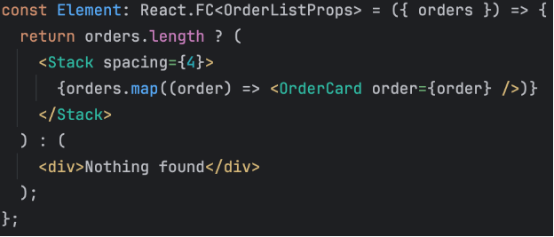
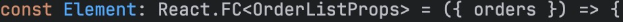
### Вопрос
Что не так в фрагменте кода?
### Ответ
Компонент имеет слишком общее название, из которого неясно, что именно он отображает. Корректный нейминг будет выглядеть так:

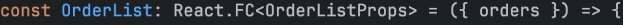
### ——————————————————————————————————————

### Вопрос
В фрагменте кода массив заказов orders с помощью метода map преобразуется в список карточек с данными заказов. Чего здесь не хватает?
### Ответ:
1. Не хватает атрибута key. В React каждый элемент списка должен иметь уникальный идентификатор, чтобы эффективно отслеживать изменения в списке и минимизировать количество перерисовок. Это помогает оптимизировать рендеринг.  
2. Добавить атрибут key для каждого элемента списка можно так:  
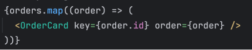
### ——————————————————————————————————————
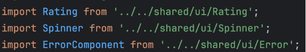
### Вопрос
Что не так в этом фрагменте кода? 
### Ответ
Импорты сделаны неаккуратно. Чтобы  решить проблему, нужно добавить файл index.ts в директорию и экспортировать все компоненты из одного файла.

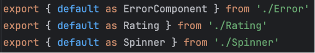
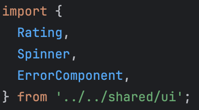
