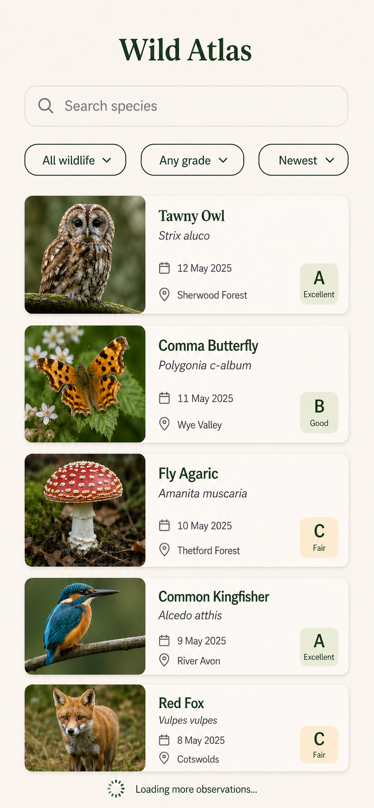
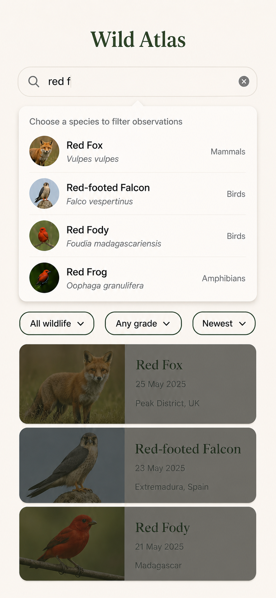
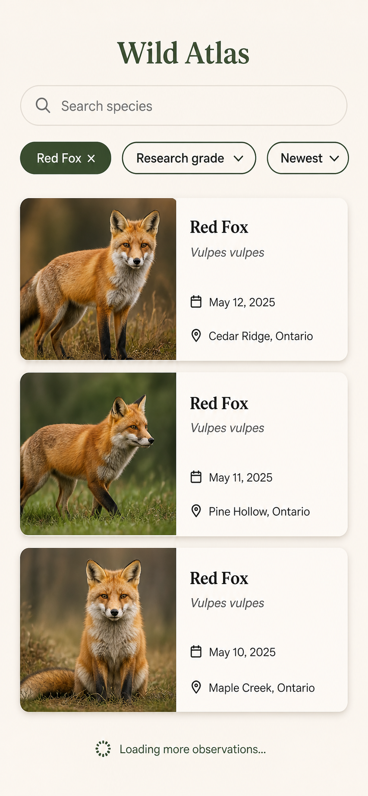
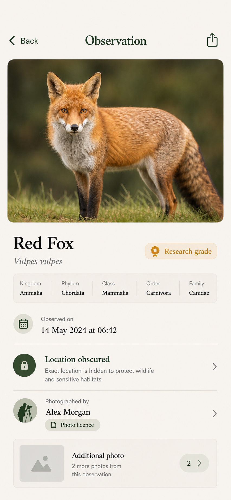

# Тестовое задание для стажёра iOS - осень 2026

## Общее описание

Необходимо создать iOS-приложение **Wildlife Atlas** для просмотра наблюдений за дикой природой.
Приложение должно состоять из двух экранов:

1. Экран со списком наблюдений;
2. Экран с подробной информацией о наблюдении.

Для получения данных используйте [iNaturalist API](https://www.inaturalist.org/pages/api+reference).
Приложение работает с публичными данными, но не вносит изменений в них.

> Термин "таксон" (англ. taxon) для простоты можно трактовать как "группа живых организмов".

Внешний вид приложения остается на усмотрение автора, при этом всячески приветствуется
использование лучших практик построения iOS-интерфейсов там, где они применимы.

## Референсы интерфейса

- [Лента наблюдений по умолчанию](images/01-wild-atlas-explore-default-feed-reference.png)
- [Автодополнение при поиске таксона](images/02-wild-atlas-explore-taxon-autocomplete-reference.png)
- [Отфильтрованная лента и пагинация](images/03-wild-atlas-explore-filtered-red-fox-pagination-reference.png)
- [Экран подробной информации о наблюдении](images/04-wild-atlas-observation-detail-reference.png)

### Лента наблюдений по умолчанию

### Автодополнение при поиске таксона

### Отфильтрованная лента и пагинация

### Экран подробной информации о наблюдении

## Требования к содержанию

### Экран 1: Список наблюдений

При первом открытии экрана отображается первая страница последних публичных наблюдений.

> Поскольку речь идет о дикой природе, то всегда используйте параметр `captive=false`.

Каждый элемент списка содержит:

- Фото-превью наблюдения
- Общепринятое и научное названия организма
- Дату наблюдения
- Отметку о качестве наблюдения

Экран поддерживает постраничную загрузку. При достижении конца загруженного списка необходимо запросить следующую страницу, если она доступна.

Помимо стандартного списка, экран поддерживает режим отображения элементов "плитка"
(пользователю доступно переключение режимов).

При нажатии на элемент списка открывается экран с подробной информацией о наблюдении.

#### Поиск таксона

Также экран отображает поисковую строку для поиска по каталогу таксонов iNaturalist.
При вводе поискового запроса пользователю показывается динамический список подходящих таксонов.
Выбранное пользователем значение используется фильтром "Таксон".

**Дополнительным** плюсом решения будет сохранение последних пяти выбранных таксонов
(предлагаем их сразу при обращении к поиску, пока пользователь не начал ввод).

#### Фильтры

На экране списка должны быть доступны три **независимых** фильтра:

1. Таксон: "Все наблюдения" или выбранный таксон.
2. Качество: "Любое" или "Исследовательское".
3. Порядок: "Сначала новые" или "Сначала старые", по дате наблюдения.

Изменение значения любого из фильтров влечет перезагрузку списка, с учетом текущих значений остальных фильтров.

### Экран 2 - Детали наблюдения

Экран открывается по идентификатору выбранного наблюдения и отображает:

- Фотографию наблюдения
- Общепринятое и научное названия организма
- Отметку о качестве наблюдения
- Дату наблюдения
- Доступную информацию о таксоне
- Приближенное указание места наблюдения
- Автора наблюдения, атрибуцию и лицензию фотографии, если эти данные есть в ответе сервера

Необходимо сделать возможным возврат к списку наблюдений, в котором сохранены ранее загруженные данные,
выбранные фильтры и позиция скролла.

**Дополнительными** плюсами решения будут

- возможность просматривать _все_ доступные фото наблюдения во встроенной в экран галерее
- возможность поделиться текущим наблюдением

## Нефункциональные требования

1. Приложение написано на языке Swift.
2. Приложение не использует сторонние библиотеки.
3. Для сетевых запросов используйте `URLSession`.
4. Приложение не использует сервисы геолокации, не отображает точные координаты. Для скрытых или приватных наблюдений данные о местности не отображаются.

Каждый экран должен корректно реализовать состояния:

- отображение контента;
- отображение "пустого" состояния;
- отображение ошибки, с возможностью повторить запрос;
- состояние загрузки данных.

Элементы не отображаются на экране, если необходимая часть информации отсутствует в ответе сервера.

## Дополнительные фичи

1. Кэширование изображений в памяти.
2. Локальные закладки: раздел с избранными наблюдениями.

## Оформление решения

1. Добавьте файл `README.md`, где при необходимости добавьте инструкции по сборке/запуску приложения,
отразите ключевые решения, принятые в ходе реализации, и то, **почему** они именно такие.
2. Добавьте файл `AI_USAGE.md`.
Использование AI-инструментов **разрешено** и само по себе не влияет на оценку решения.
Напротив, этот файл дает возможность продемонстрировать прозрачное использование AI и
может послужить отправной точкой для презентации решения в ходе технического интервью.

    Если использовались AI-инструменты, то опишите:

    - какие инструменты использовались (по возможности укажите модель и версию)
    - для каких задач они использовались (поиск, прототипирование, написание кода/тестов и тп)
    - добавьте ключевые промпты (inline или отдельными файлами), которые существенно повлияли на результат
    - какие части решения были созданы инструментами AI
    - какие предложения AI были отклонены и почему

    Если AI-инструменты не использовались, то явно укажите это в файле:

    > При выполнении задания AI-инструменты не использовались.
