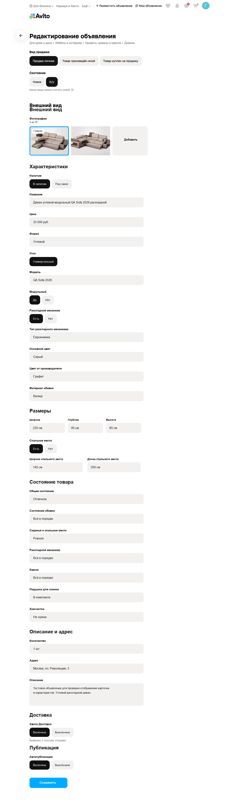
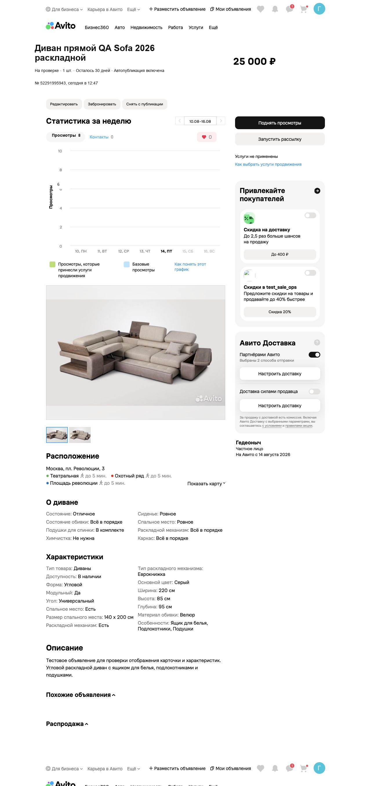
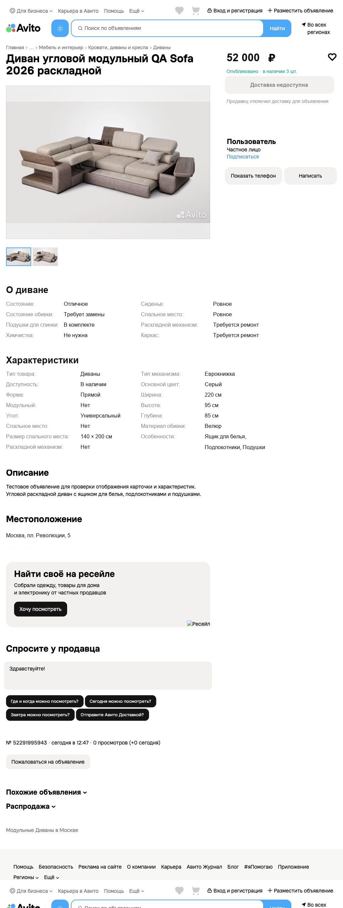

## **Тестовое задание для стажёра QA (осенняя волна 2026\)**

Есть две обязательные части:

* Задание 1 — одинаковое для всех участников.  
* Задание 2 — включает два варианта, из которых вам необходимо выбрать и решить один. Оценка второго задания не зависит от выбранного варианта, они оцениваются проверяющими равнозначно.

Важно: результаты выполнения обоих заданий должны быть размещены в одном репозитории, а все файлы — в корневом каталоге.

## **Задание 1**

Контекст:

* Дана карточка продавца, карточка товара и заполненная форма редактирования объявления (Диваны). Заполненная форма — истина.  
* Задача по скриншотам — найти визуальные баги, несоответствие данных, логические противоречия.  
* При нахождении багов не из списка (не ошибок) снимается балл.

Ссылки на скриншоты:

* [Заполненная форма редактирования](https://drive.google.com/file/d/1jVmZyPtSsMqVbkf_sQVX3e0bmNH0Ix18/view?usp=sharing)  
* [Карточка продавца](https://drive.google.com/file/d/1sRxQqr7mOjBcX9uMJ18GMT52onD6Tz7O/view?usp=sharing)  
* [Карточка товара](https://drive.google.com/file/d/1mSG2furdRm9aLjt7tWKSXaD5iaWXyzgQ/view?usp=sharing)

### Заполненная форма редактирования

### Карточка продавца

### Карточка товара

**Описание задания:** Найдите баги на приложенных скриншотах, приоритезируйте их и опишите. Приоритеты: P0 — критический, P1 — высокий, P2 — средний, P3 — низкий. Пример: P0 — не открывается объявление из выдачи. Для формулировки ожидаемого результата считаем истиной скриншот «Форма редактирования».

---

## **Задание 2.1 (API)**

**Условие:** Дан микросервис для работы с пользователями, объявлениями и статистикой. В сервисе доступны следующие ручки:

* `POST /api/1/register` — зарегистрировать пользователя.  
* `POST /api/1/autorize` — авторизовать пользователя и получить bearer-токен.  
* `POST /api/1/item` — создать объявление.  
* `GET /api/1/item/{id}` — получить объявление по его идентификатору.  
* `GET /api/1/{sellerID}/item` — получить все объявления продавца.  
* `GET /api/1/statistic/{id}` — получить статистику объявления, версия 1\.  
* `GET /api/2/statistic/{id}` — получить статистику объявления, версия 2\.  
* `DELETE /api/2/item/{id}` — удалить объявление по его идентификатору.

Host — [https://qa-internship.avito.com](https://qa-internship.avito.com)  
Postman-коллекция: [postman_collection.json](postman_collection.json)

**Особенности:**

* Ручки `POST /api/1/register` и `POST /api/1/autorize` являются публичными.  
* Все остальные API-ручки защищены и требуют заголовок `Authorization: Bearer <accessToken>`.  
* Регистрация возвращает `id` и `username` созданного пользователя.  
* Авторизация возвращает `accessToken` и `tokenType`.  
* При создании объявления `sellerID` должен совпадать с `id` авторизованного пользователя из bearer-токена. Нельзя использовать произвольный `sellerID` или подменять пользователя через `X-UserId`.  
* Каждое созданное объявление получает уникальный UUID.  
* Поля `name`, `price`, `sellerID` и `statistics` могут повторяться у разных объявлений.  
* Тесты выполняются на общем стенде, поэтому используйте уникальные данные и не полагайтесь на состояние, созданное другими кандидатами.

**Суть задания:**

1. Составьте тест-кейсы для проверки API и опишите их в файле `TESTCASES.md`.

Тест-кейсы должны покрывать: позитивные сценарии; негативные сценарии; граничные значения и корнер-кейсы; функциональные и релевантные нефункциональные проверки; регистрацию, авторизацию и проверку доступа к защищённым ручкам; другие важные аспекты, которые вы считаете нужными. Используйте подходящие техники тест-дизайна.

2. Автоматизируйте написанные тест-кейсы.  
* Реализуйте содержательные проверки с помощью assert.  
* Получайте bearer-токен через `/api/1/autorize` и используйте его для защищённых запросов.  
* Создавайте пользователя и остальные тестовые данные динамически.  
* Тесты должны быть независимыми, воспроизводимыми и не зависеть от порядка запуска.  
* После тестов по возможности удаляйте созданные объявления и возвращайте окружение в исходное состояние.  
* Тесты должны успешно проходить, если сервис работает корректно, либо падать с понятным обоснованием и связанным баг\-репортом.  
3. Оформите результаты.  
* `TESTCASES.md` — тест-кейсы с предусловиями, шагами и ожидаемыми результатами.  
* `README.md` — инструкция по установке зависимостей, настройке окружения и запуску тестов.  
* `BUGS.md` — найденные дефекты: краткое описание, шаги воспроизведения, фактический и ожидаемый результат, серьёзность и окружение. Если дефекты не найдены, файл не обязателен.  
* `PROMPTS.md` — промпты, которые использовались при работе с ИИ. Если ИИ не использовался, файл не обязателен.

**Использование ИИ:** Если при анализе задания, составлении тест-кейсов или реализации автотестов вы использовали ИИ, приложите использованные промпты в файл `PROMPTS.md` в репозитории с решением. Не включайте в файл токены, пароли и другие секреты.

**Дополнительные задания** (необязательны, но позволяют продемонстрировать более глубокие навыки):

1. Реализовать сквозной E2E-сценарий: регистрация → авторизация → создание объявления → получение объявления и статистики → удаление.  
2. Подключить Allure или другой понятный отчёт, добавить шаги и полезные вложения, приложить пример сформированного отчёта.  
3. Настроить линтер и форматтер, зафиксировать правила и описать команды запуска в `README.md`.

---

## **Задание 2.2 (UI)**

**Условие:** На сайте размещён [кабинет](http://195.19.209.79/ads) продавца для работы с объявлениями. Платформа состоит из:

* страницы списка объявлений (`/ads`);  
* страницы просмотра объявления (`/ads/:id`);  
* страницы редактирования объявления (`/ads/:id/edit`).

**Суть задания:** Составьте тест-кейсы на пользовательские сценарии из списка ниже.

На десктопной версии сайта:

* Страница «Мои объявления»: проверить поиск по названию.  
* Страница «Мои объявления»: проверить сортировку по дате и названию.  
* Страница «Мои объявления»: проверить фильтр по категории, переключатель «Только требующие доработок» и кнопку «Сбросить фильтры».  
* Страница «Мои объявления»: проверить пагинацию и переход на страницу объявления по клику на карточку.  
* Страница редактирования: проверить валидацию обязательных полей, сохранение изменений и отмену редактирования.  
* Страница редактирования: проверить работу AI-инструментов «Улучшить/Придумать описание» и «Узнать цену».

На мобильной версии сайта:

* Проверить переключение между тёмной и светлой темой.

Автоматизируйте тест-кейсы:

* Обязательна проверка результатов (assertions).  
* При обнаружении бага отчёт после прогона должен явно это отражать.  
* Отчёт должен быть лаконичным и понятным.

Запустите автоматизированные тесты:

* Все тесты проходят, если багов нет.  
* Не допускаются «сломанные» тесты: тест либо падает из\-за найденного бага, либо проходит успешно.

**Что стоит учитывать:** Вы работаете с общим тестовым стендом. Данные могут изменяться другими пользователями во время выполнения задания. Учитывайте это при написании автотестов:

* не опирайтесь на фиксированное количество объявлений;  
* не используйте заранее заданные ID и названия объявлений;  
* не предполагайте неизменность конкретных записей;  
* выбирайте тестовые данные из фактически загруженного списка;  
* не проверяйте точный текст ответа AI;  
* после изменения объявления по возможности/при необходимости восстанавливайте исходные данные.

**Как повысить свои шансы на высокую оценку:** В `README.md` нужно максимально лаконично и понятно описать, как запустить тесты. После клонирования репозитория тесты должны запускаться стандартной командой без длительной ручной настройки окружения.

**Нефункциональные требования:**

* Оформите тест-кейсы в файле `TESTCASES.md`.  
* Для автоматизации можно использовать любой удобный фреймворк и язык программирования.  
* Оформите инструкцию по запуску в файле `README.md`.  
* Если найдены баги, составьте баг\-репорты в файле `BUGS.md`.

**Использование ИИ:** Если при анализе задания, составлении тест-кейсов или их реализации вы использовали ИИ, приложите использованные промпты в файл `PROMPTS.md` в репозитории с решением. Не включайте в файл токены, пароли и другие секреты.
