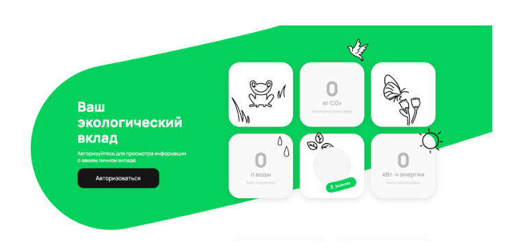

# Тестовое задание для стажёра QA (весенняя волна 2024)
## Общие вводные

1. Для выполнения тестового задания вам понадобится аккаунт на GitHub.  
2. Результаты выполнения обоих заданий должны находиться в одном репозитории, а все файлы лежать в корневом каталоге.

## Задание 1

Перед вами [скриншот страницы Авито с результатами поиска](https://drive.google.com/file/d/1B8MtTrzyDRN8lZkRQY0wiLBqRs-ly3LJ/view?usp=drive\_link).   
Изучите скриншот, перечислите все имеющиеся баги на странице поиска, укажите их приоритет (high, medium, low).

## Задание 2

### **Контекст**

Скриншотные тесты используются для проверки визуального отображения интерфейса: дизайна, шрифтов, вёрстки, расположения элементов.   
Это один из самых нестабильных видов тестирования, но только он позволяет убедиться, что пользователь видит страницу именно такой, какой её задумал дизайнер.   
Для скриншотных тестов нужно получить «эталонные» снимки и своими глазами проверить, что на них всё так, как должно быть — в этом и будет смысл задания. 

### **Условие**

На [странице](https://www.avito.ru/avito-care/eco-impact) расположены три счётчика для подсчёта эковклада пользователя: сохраненного объёма воды, предотвращенного объёма выброса CO2 и сэкономленной электроэнергии.

Числа, отображаемые на счётчиках приходят с бэкенда. 

Обработку этих значений выполняет микрофронтенд: в его задачи, например, входит подстановка единиц измерений: замена 1000 литров на 1 метр кубический и т.д.

### **Суть задания:**

1. **Составьте тест-кейсы для тестирования счётчиков для десктопной версии**. Оформите решение в файле TESTCASES.md   
2. **Автоматизируйте тест-кейсы**.   
   1\) Можно выполнить на любом языке,  фреймворке, драйвере (мы рекомендуем использовать связку python \+ pytest \+ playwright, но вы можете выбрать удобную вам);  
   2\) В автоматизированных тест-кейсах не нужно проверять результат, а только получить скриншот счётчиков (желательно сделать скриншот именно счётчика, а не всей страницы).  
3. **Запустите автоматизированные тесты**  
   1\) Все тесты должны быть пройдены успешно  
   2\) В папке «output»  должны появиться скриншоты счётчиков  
   3\) Имена скриншотов должны соответствовать номерам тест-кейсов  
4. **Запушьте все скриншоты в репозиторий**  
5. **Напишите понятную и воспроизводимую инструкцию**, выполнив которую можно заново получить все скриншоты в папке «output». Оформите инструкцию в файле README.md  
6. Если в результате тестирования найдены баги, то **составьте баг\-репорт** в файле BUGS.md

### 

### **Подсказки для успешного выполнения Задания 2**

**Подсказка 1:** применяйте техники тест-дизайна и минимизируйте количество тест-кейсов.

**Подсказка 2:** оцените выполненное вами задание, поставив себя на место проверяющего и задайте себе проверочные вопросы: 

- понятна ли моя инструкция?  
- как по полученному результату можно оценить качество выполнения задания?

##  Оформление заданий и проверка

1. Результаты должны быть размещены в публичном репозитории на GitHub;  
2. Оцениваться будут не только выбранный подход к тестированию и количество кейсов, но и структура, организация артефактов, понятность документации.
